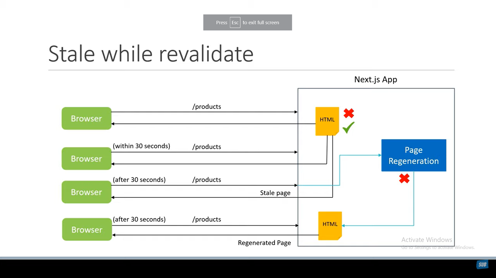

# Incremental Static Regeneration

## what problem solves?

1. if we have a small amount of pages the build time is not a problem but if we have a lot of pages we need to build the whole app again.
2. if we use the getStaticPaths with fallback set to true or blocking the app we be served with
   the first served of the app than get cashed.
3. if we want the latest data we have to rebuild the app every time we change the data.

## to solve this problem we will use Incremental Static Regeneration

by adding revalidate to the getStaticProps we can tell the client to revalidate the cache.
but first it get regenerated by the server the nextjs will send the stale data to the client.
manning the pages will be regenerated and and send to the client after the regeneration.

### but the revalidation only happens if the client visit the page, if one day there is no one visit the page will not be revalidated.

its simply revalidated after which the user visit the page.

