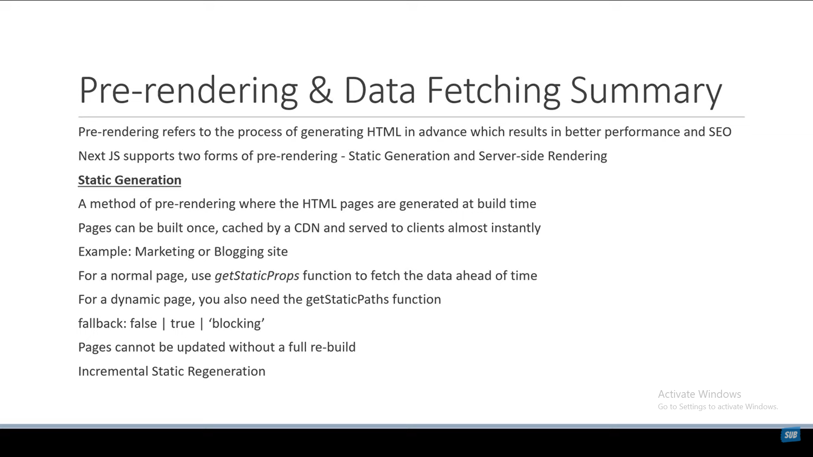
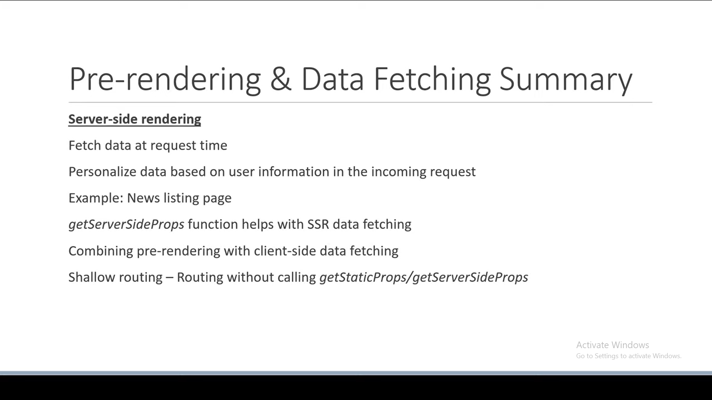

# Nextjs

## [docs](https://nextjs.org/docs/getting-started)

## next fearers

1. file based routing
2. pre-rendering
3. API routing
4. Support for css modules
5. Authentication
6. dev and prod environments

## Next files structure

1. next.config.js - configuration file for nextjs
2. folder
   1. styles - css files for the organization
   2. public - its like the public folder in react
   3. pages - all the pages for the routing system

- when run npm run dev, next will execute the \_app.js file
  - in the app.js file we have the component prop that we can pass to the page its referring to the component in the index.js file
- Routing folder
  - index.js - is the main file for the routing system
  - for nested routes we can use the folder structure
    - index.js - is the main file for the routing system
  - for dynamic routes will be by `[id].js`
    - using hook from nextjs useRouter from the next/router
    - if we have a specific route in the dynamic route folder next will execute the file with the name of the route
    - catch all route will be the last route in the folder [...params] will be the catch all route if we want to be a optional [[...params]]
  - to navigate throw the app we can ues the Link component from next/link
  - using router.push or replace will dynamically change the route

## pre-rendering

- by default nextjs will pre-render the page before the user sees it
  - if you export getStaticProps from the page component
    it will run at the built time it return an object with the props property
    this props will be passed to the page component
    [incremental static regeneration](./Incremental-Static-Regeneration.md)

## summary of static site generation

## summary of server side rendering

[Server-side-Rendering](./Server-side-Rendering.md)

summary

