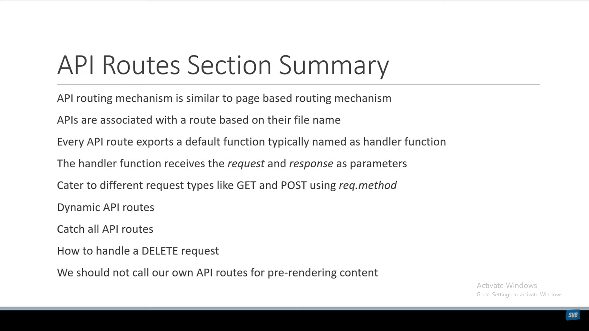

# Next js Api

1. create a folder called api in the pages folder
2. its smiler to pages routing
3. to do any request other than the get request we can use the `req.method` to check the request type
4. don't use your api in getStaticPaths or getServerSideProps or getStaticProps instead use your
   onw database or any source of data
5. params are dynamic parameters that are passed to the page and called query params
   
